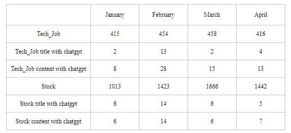
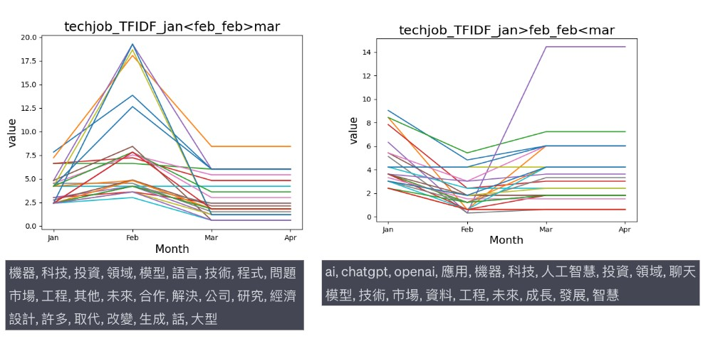
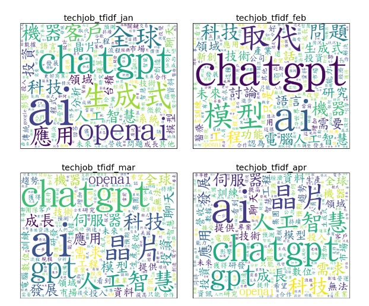
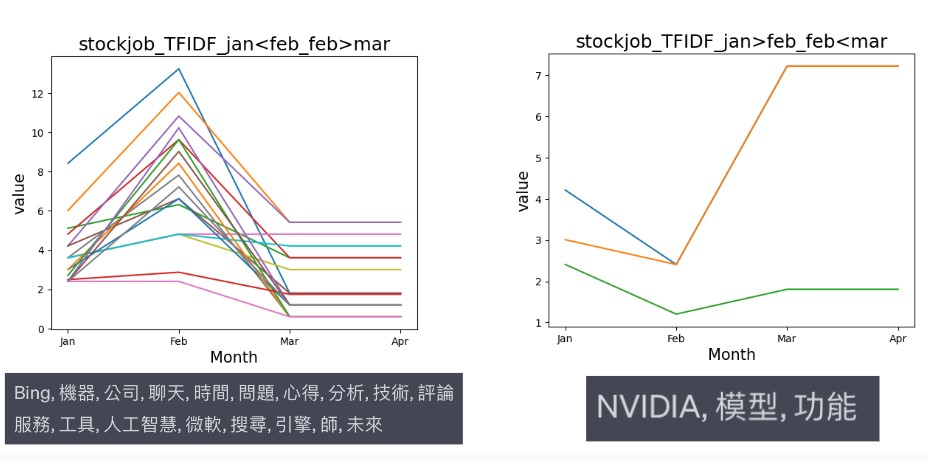
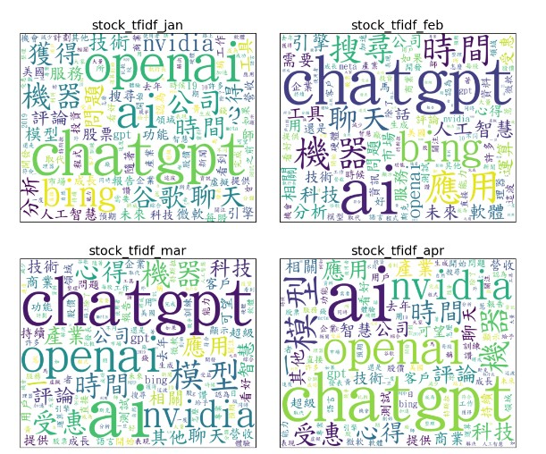
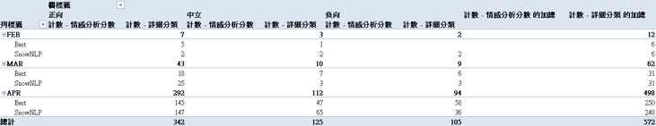
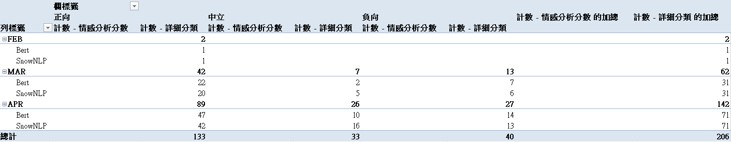
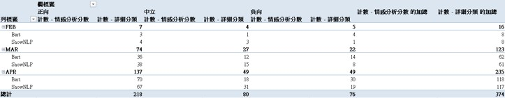

# Exploring the Emotional Intentions of Social Media Users Towards ChatGPT

📃 <a href="https://github.com/Chia-Wei-Wu/sentiment_PTT_chatgpt/blob/main/docs/Paper.pdf" target="_blank"><b>Paper</b></a>  
•
📎 <a href="https://github.com/Chia-Wei-Wu/sentiment_PTT_chatgpt/blob/main/docs/Presentation.pdf" target="_blank"><b>Presentation</b></a>  

## Contributors
|組員|工作分配|
|-|-|
|吳家瑋|PTT Scrapy, Code(PTT Data processing, cnsenti(failed)), GitHub, PPT|
|王玓澄|Code(Facebook-Scraper, FB Data Processing, Sentiment), PPT|
|郭達穎|Code(TF-IDF, WordCloud), PPT|
|李皓鈞|PTT Scrapy, Code(textblob(failed),snownlp), PPT|
## Motivation
* “ChatGPT” is a large-scale language model based on the GPT-3.5 architecture with potential for a wide range of applications, especially in social media.
* “PTT” attracts many users with its free and open discussion environment and diverse topics. It is a platform for people to exchange opinions, share knowledge and build communities.
* “FB” is also the top choice that tech people often discuss new trends on not only groups but fan pages, even on their personal profile.
* Hence, we analyze the direction of ChatGPT's public opinion on PTT to understand the usage of ChatGPT on social media.
## Related work
* Jieba: Jieba is a popular Chinese text segmentation library to split Chinese text into individual words or tokens used for NLP tasks like Information Retrieval, Machine Translation, Keyword Extraction, and so on.(https://pypi.org/project/jieba/)
* Term Frequency-Inverse Document Frequency(TF-IDF): It is a technique for assessing the importance of terms in a document collection, and it is commonly used in various tasks, including Information Retrieval, Document Similarity,  and Keyword Extraction.
* SnowNLP: SnowNLP is a Python library designed for natural language processing tasks about the Chinese language to do Sentiment analysis.(https://github.com/isnowfy/snownlp)
* Facebook-scraper: Scrape Facebook public pages without an API key.(https://github.com/kevinzg/facebook-scraper)
* Bert-Chinese-Text-Classification-Pytorch: Chinese text classification, Bert, ERNIE, pre-trained model based on pytorch.(https://github.com/649453932/Bert-Chinese-Text-Classification-Pytorch)
* Free and public Chinese sentiment analysis kit, which contains various tools that can be used for Chinese sentiment analysis research, such as Chinese opinions, word formation dictionaries, Chinese opinion treebanks, and opinion mining scoring tools , and in-depth community position analysis model, etc.(https://jlis.glis.ntnu.edu.tw/ojs/index.php/jlis/article/view/732)

## Experiment
### PTT analysis 
#### About Data
* Using PTT Scrapy to collect "Tech_Job" and "stock" board.
* Using jieba to token and delete Stopword by our defined dictionary.
* Classification by “date” with title having keyword “Chatgpt”.
* Classification by “date” with content having keyword “Chatgpt”.
* The statistic about our dataset.
* 
#### TF-IDF result
* Tech_Job topN
* 
* Tech_Job WordCloud 
* 
* Stock topN
* 
* Stock WordCloud
* 
#### Sentiment analysis
* PTT sentiment analysis by SnowNLP.
* 
### FaceBook analysis
#### About dataset
* Using Facebook-scraper to collect data.
* Using jieba to token and delete Stopword by our defined dictionary.

#### TF-IDF result
* You can find the result in the "Bert-Chinese-Text-Classification-Pytorch" folder.
* It creates by jieba.
#### Sentiment analysis
* The result of group "ChatGPT_生活運用"
* 
* The result of group "ChatGPT_TW"
* 
* The result of group "ChatGPT_CH"
* 
## Future prospects
* Optimize word segmentation method.
* Discuss other PTT boards.
* Discuss other social media platforms like IG, Twitter.
* Improve sentiment analysis techniques like using transform model.
* More models to do ensemble to get better result.
